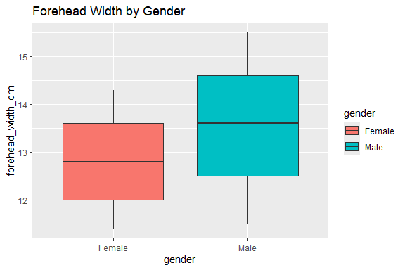

Gender Classification
================
Trevor Okinda
2024

- [Student Details](#student-details)
- [Setup Chunk](#setup-chunk)
  - [Source:](#source)
  - [Reference:](#reference)
- [Understanding the Dataset (Exploratory Data Analysis
  (EDA))](#understanding-the-dataset-exploratory-data-analysis-eda)
  - [Loading the Dataset](#loading-the-dataset)
  - [Measures of Frequency](#measures-of-frequency)
  - [Measures of Central Tendency](#measures-of-central-tendency)
  - [Measures of Distribution](#measures-of-distribution)
  - [Measures of Relationship](#measures-of-relationship)
  - [ANOVA](#anova)
  - [Plots](#plots)
- [Preprocessing & Data
  Transformation](#preprocessing--data-transformation)
  - [Missing Values](#missing-values)

# Student Details

|                       |                       |
|-----------------------|-----------------------|
| **Student ID Number** | 134780                |
| **Student Name**      | Trevor Okinda         |
| **BBIT 4.2 Group**    | C                     |
| **Project Name**      | Gender Classification |

# Setup Chunk

**Note:** the following KnitR options have been set as the global
defaults: <BR>
`knitr::opts_chunk$set(echo = TRUE, warning = FALSE, eval = TRUE, collapse = FALSE, tidy = TRUE)`.

More KnitR options are documented here
<https://bookdown.org/yihui/rmarkdown-cookbook/chunk-options.html> and
here <https://yihui.org/knitr/options/>.

### Source:

The dataset that was used can be downloaded here: *\<<a
href="https://www.kaggle.com/datasets/elakiricoder/gender-classification-dataset/data\"
class="uri">https://www.kaggle.com/datasets/elakiricoder/gender-classification-dataset/data\</a>\>*

### Reference:

*\<ElakiriCoder. (2023). Gender Classification Dataset \[Data set\].
Kaggle. <a
href="https://www.kaggle.com/datasets/elakiricoder/gender-classification-dataset\"
class="uri">https://www.kaggle.com/datasets/elakiricoder/gender-classification-dataset\</a>\>  
Refer to the APA 7th edition manual for rules on how to cite datasets:
<https://apastyle.apa.org/style-grammar-guidelines/references/examples/data-set-references>*

# Understanding the Dataset (Exploratory Data Analysis (EDA))

## Loading the Dataset

``` r
# Load dataset
GenderData <- read.csv("gender_classification_v7.csv", colClasses = c(
  long_hair = "factor",
  forehead_width_cm = "numeric",
  forehead_height_cm = "numeric",
  nose_wide = "factor",
  nose_long = "factor",
  lips_thin = "factor",
  distance_nose_to_lip_long = "factor",
  gender = "factor"
))

# Preview structure
str(GenderData)
```

    ## 'data.frame':    5001 obs. of  8 variables:
    ##  $ long_hair                : Factor w/ 2 levels "0","1": 2 1 1 1 2 2 2 1 2 2 ...
    ##  $ forehead_width_cm        : num  11.8 14 11.8 14.4 13.5 13 15.3 13 11.9 12.1 ...
    ##  $ forehead_height_cm       : num  6.1 5.4 6.3 6.1 5.9 6.8 6.2 5.2 5.4 5.4 ...
    ##  $ nose_wide                : Factor w/ 2 levels "0","1": 2 1 2 1 1 2 2 1 2 1 ...
    ##  $ nose_long                : Factor w/ 2 levels "0","1": 1 1 2 2 1 2 2 1 1 1 ...
    ##  $ lips_thin                : Factor w/ 2 levels "0","1": 2 2 2 2 1 2 2 1 2 1 ...
    ##  $ distance_nose_to_lip_long: Factor w/ 2 levels "0","1": 2 1 2 2 1 2 1 1 2 1 ...
    ##  $ gender                   : Factor w/ 2 levels "Female","Male": 2 1 2 2 1 2 2 1 1 1 ...

``` r
head(GenderData)
```

    ##   long_hair forehead_width_cm forehead_height_cm nose_wide nose_long lips_thin
    ## 1         1              11.8                6.1         1         0         1
    ## 2         0              14.0                5.4         0         0         1
    ## 3         0              11.8                6.3         1         1         1
    ## 4         0              14.4                6.1         0         1         1
    ## 5         1              13.5                5.9         0         0         0
    ## 6         1              13.0                6.8         1         1         1
    ##   distance_nose_to_lip_long gender
    ## 1                         1   Male
    ## 2                         0 Female
    ## 3                         1   Male
    ## 4                         1   Male
    ## 5                         0 Female
    ## 6                         1   Male

``` r
View(GenderData)
```

## Measures of Frequency

``` r
#Measures of Frequency
# Frequency of categorical variables
table(GenderData$gender)
```

    ## 
    ## Female   Male 
    ##   2501   2500

``` r
table(GenderData$long_hair)
```

    ## 
    ##    0    1 
    ##  652 4349

``` r
table(GenderData$nose_wide)
```

    ## 
    ##    0    1 
    ## 2531 2470

``` r
table(GenderData$nose_long)
```

    ## 
    ##    0    1 
    ## 2461 2540

``` r
table(GenderData$lips_thin)
```

    ## 
    ##    0    1 
    ## 2535 2466

``` r
table(GenderData$distance_nose_to_lip_long)
```

    ## 
    ##    0    1 
    ## 2506 2495

## Measures of Central Tendency

``` r
# Measures of Central Tendency
# Mean and median
mean(GenderData$forehead_width_cm)
```

    ## [1] 13.18148

``` r
median(GenderData$forehead_width_cm)
```

    ## [1] 13.1

``` r
mean(GenderData$forehead_height_cm)
```

    ## [1] 5.946311

``` r
median(GenderData$forehead_height_cm)
```

    ## [1] 5.9

``` r
# Mode function (since base R doesn't have one)
get_mode <- function(v) {
  uniqv <- unique(v)
  uniqv[which.max(tabulate(match(v, uniqv)))]
}

get_mode(GenderData$forehead_width_cm)
```

    ## [1] 12

``` r
get_mode(GenderData$forehead_height_cm)
```

    ## [1] 5.7

## Measures of Distribution

``` r
# Measures of Distribution
# Distribution metrics
sd(GenderData$forehead_width_cm)
```

    ## [1] 1.107128

``` r
range(GenderData$forehead_width_cm)
```

    ## [1] 11.4 15.5

``` r
IQR(GenderData$forehead_width_cm)
```

    ## [1] 1.8

``` r
sd(GenderData$forehead_height_cm)
```

    ## [1] 0.5412679

``` r
range(GenderData$forehead_height_cm)
```

    ## [1] 5.1 7.1

``` r
IQR(GenderData$forehead_height_cm)
```

    ## [1] 0.9

## Measures of Relationship

``` r
# Measures of Relationship
# Correlation between numeric variables
cor(GenderData$forehead_width_cm, GenderData$forehead_height_cm)
```

    ## [1] 0.08859643

``` r
# Chi-square test between categorical variables and gender
chisq.test(table(GenderData$long_hair, GenderData$gender))
```

    ## 
    ##  Pearson's Chi-squared test with Yates' continuity correction
    ## 
    ## data:  table(GenderData$long_hair, GenderData$gender)
    ## X-squared = 0.51755, df = 1, p-value = 0.4719

``` r
chisq.test(table(GenderData$nose_wide, GenderData$gender))
```

    ## 
    ##  Pearson's Chi-squared test with Yates' continuity correction
    ## 
    ## data:  table(GenderData$nose_wide, GenderData$gender)
    ## X-squared = 2874.2, df = 1, p-value < 2.2e-16

``` r
chisq.test(table(GenderData$nose_long, GenderData$gender))
```

    ## 
    ##  Pearson's Chi-squared test with Yates' continuity correction
    ## 
    ## data:  table(GenderData$nose_long, GenderData$gender)
    ## X-squared = 2766.4, df = 1, p-value < 2.2e-16

``` r
chisq.test(table(GenderData$lips_thin, GenderData$gender))
```

    ## 
    ##  Pearson's Chi-squared test with Yates' continuity correction
    ## 
    ## data:  table(GenderData$lips_thin, GenderData$gender)
    ## X-squared = 2760.2, df = 1, p-value < 2.2e-16

``` r
chisq.test(table(GenderData$distance_nose_to_lip_long, GenderData$gender))
```

    ## 
    ##  Pearson's Chi-squared test with Yates' continuity correction
    ## 
    ## data:  table(GenderData$distance_nose_to_lip_long, GenderData$gender)
    ## X-squared = 2846.5, df = 1, p-value < 2.2e-16

## ANOVA

``` r
# ANOVA for forehead_width_cm by gender
anova_fw <- aov(forehead_width_cm ~ gender, data = GenderData)
summary(anova_fw)
```

    ##               Df Sum Sq Mean Sq F value Pr(>F)    
    ## gender         1    684   684.2   628.2 <2e-16 ***
    ## Residuals   4999   5444     1.1                   
    ## ---
    ## Signif. codes:  0 '***' 0.001 '**' 0.01 '*' 0.05 '.' 0.1 ' ' 1

``` r
# ANOVA for forehead_height_cm by gender
anova_fh <- aov(forehead_height_cm ~ gender, data = GenderData)
summary(anova_fh)
```

    ##               Df Sum Sq Mean Sq F value Pr(>F)    
    ## gender         1  112.6  112.55   416.1 <2e-16 ***
    ## Residuals   4999 1352.3    0.27                   
    ## ---
    ## Signif. codes:  0 '***' 0.001 '**' 0.01 '*' 0.05 '.' 0.1 ' ' 1

## Plots

``` r
#Plots
library(ggplot2)

# Bar plots for categorical variables
ggplot(GenderData, aes(x = long_hair)) + 
  geom_bar(fill = "skyblue") + 
  ggtitle("Frequency of Long Hair")
```

<!-- -->

``` r
ggplot(GenderData, aes(x = nose_wide)) + 
  geom_bar(fill = "tomato") + 
  ggtitle("Frequency of Wide Nose")
```

<!-- -->

``` r
ggplot(GenderData, aes(x = lips_thin)) + 
  geom_bar(fill = "plum") + 
  ggtitle("Frequency of Thin Lips")
```

<!-- -->

``` r
# Histograms for numeric variables
ggplot(GenderData, aes(x = forehead_width_cm)) + 
  geom_histogram(fill = "steelblue", bins = 15) + 
  ggtitle("Distribution of Forehead Width (cm)")
```

<!-- -->

``` r
ggplot(GenderData, aes(x = forehead_height_cm)) + 
  geom_histogram(fill = "darkseagreen", bins = 15) + 
  ggtitle("Distribution of Forehead Height (cm)")
```

<!-- -->

``` r
# Boxplots to compare numeric variables by gender
ggplot(GenderData, aes(x = gender, y = forehead_width_cm, fill = gender)) + 
  geom_boxplot() + 
  ggtitle("Forehead Width by Gender")
```

<!-- -->

``` r
ggplot(GenderData, aes(x = gender, y = forehead_height_cm, fill = gender)) + 
  geom_boxplot() + 
  ggtitle("Forehead Height by Gender")
```

<!-- -->

``` r
# Faceted bar plots for categorical features by gender
ggplot(GenderData, aes(x = long_hair, fill = gender)) + 
  geom_bar(position = "dodge") + 
  ggtitle("Long Hair by Gender")
```

<!-- -->

``` r
ggplot(GenderData, aes(x = nose_long, fill = gender)) + 
  geom_bar(position = "dodge") + 
  ggtitle("Long Nose by Gender")
```

<!-- -->

# Preprocessing & Data Transformation

## Missing Values

``` r
# Check for any missing values
anyNA(GenderData)
```

    ## [1] FALSE

``` r
# Count of missing values per column
colSums(is.na(GenderData))
```

    ##                 long_hair         forehead_width_cm        forehead_height_cm 
    ##                         0                         0                         0 
    ##                 nose_wide                 nose_long                 lips_thin 
    ##                         0                         0                         0 
    ## distance_nose_to_lip_long                    gender 
    ##                         0                         0

``` r
# Visual representation (optional)
library(Amelia)  # for missmap
```

    ## Loading required package: Rcpp

    ## ## 
    ## ## Amelia II: Multiple Imputation
    ## ## (Version 1.8.1, built: 2022-11-18)
    ## ## Copyright (C) 2005-2025 James Honaker, Gary King and Matthew Blackwell
    ## ## Refer to http://gking.harvard.edu/amelia/ for more information
    ## ##

``` r
missmap(GenderData, main = "Missing Values Map", col = c("yellow", "black"), legend = FALSE)
```

<!-- -->

``` r
# Alternative visual with VIM
# install.packages("VIM") # Uncomment if not installed
library(VIM)
```

    ## Loading required package: colorspace

    ## Loading required package: grid

    ## The legacy packages maptools, rgdal, and rgeos, underpinning the sp package,
    ## which was just loaded, will retire in October 2023.
    ## Please refer to R-spatial evolution reports for details, especially
    ## https://r-spatial.org/r/2023/05/15/evolution4.html.
    ## It may be desirable to make the sf package available;
    ## package maintainers should consider adding sf to Suggests:.
    ## The sp package is now running under evolution status 2
    ##      (status 2 uses the sf package in place of rgdal)

    ## VIM is ready to use.

    ## Suggestions and bug-reports can be submitted at: https://github.com/statistikat/VIM/issues

    ## 
    ## Attaching package: 'VIM'

    ## The following object is masked from 'package:datasets':
    ## 
    ##     sleep

``` r
aggr(GenderData, col = c("navyblue", "red"), numbers = TRUE, sortVars = TRUE,
     labels = names(GenderData), cex.axis = .7, gap = 3,
     ylab = c("Missing Data", "Pattern"))
```

<!-- -->

    ## 
    ##  Variables sorted by number of missings: 
    ##                   Variable Count
    ##                  long_hair     0
    ##          forehead_width_cm     0
    ##         forehead_height_cm     0
    ##                  nose_wide     0
    ##                  nose_long     0
    ##                  lips_thin     0
    ##  distance_nose_to_lip_long     0
    ##                     gender     0
